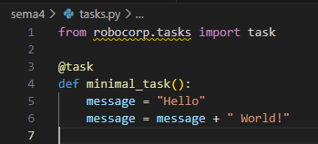
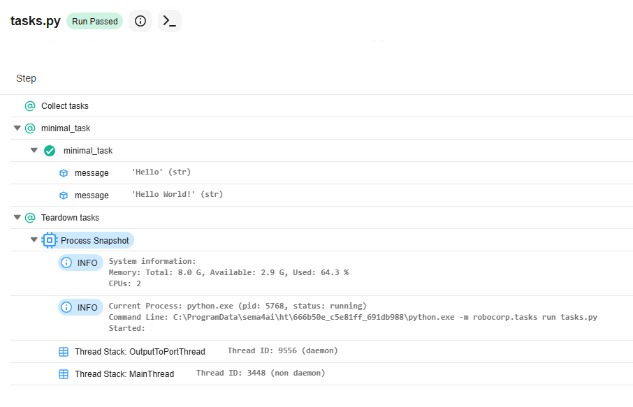

# Installing and Using Sema4.ai in VS Code

To use Sema4.ai (previously Robocorp), you need Python. Besides that, it is recommended to use an IDE, and VS Code is a good option, with extensions for Python and Sema4.ai.

## Installation

The instructions for installing Python in VS Code are from [VSCode quick start].(https://code.visualstudio.com/docs/python/python-quick-start)

### 1 VS Code

Install VS Code from https://code.visualstudio.com. The basic layout of VS Code is explained in the [documentation].(https://code.visualstudio.com/docs/getstarted/userinterface#_basic-layout)

It will ask you to create a folder for your workspace. This is the place where you will save your project.

### 2 Python

Install Python from https://www.python.org/downloads/

For Windows, add Python to the *path*.


And disable the path length limit.


### 3 VS Code Python extension

Install the Python extension from https://marketplace.visualstudio.com/items?itemName=ms-python.python

After that, you should be able to see three extensions related to Python installed in VS Code.


### 4 Sema4.ai extension

Inside VS Code, search for the extension and install it.


If you click in the *S4* icon on the left, you will see that the extension is installed.


## Creating a task from a template

As mentioned in the [VS Code documentation](https://code.visualstudio.com/docs/getstarted/userinterface#_command-palette), "the most important key combination to know is **Ctrl+Shift+P**, which brings up the Command Palette. From here, you have access to all functionality within VS Code, including keyboard shortcuts for the most common operations."

Use Ctrl+Shift+P to open the Command Palette and search for *sema4.ai: create task package*.


Then, choose the template *Python minimal*.


And use the workspace folder.


After this process, you will get a list of files for your automation project.


Open the file *tasks.py*. The minimal task simply creates a variable and assigns some text to it.



It will take some time to download all the packages that are needed (in the lower right of the screen you can follow the progress).


To run the project, you can use:
- the Command Palette (Ctrl+Shift+P) and *Sema4.ai: Run Task Package*
- **or** the icon *S4* on the left and :arrow_forward: *Run task*


You will see many messages in the terminal and finally *status: PASS* and *OK*.


You can click on the *log.html* file to open it in the browser.



You can follow all the steps of the task in the log. In this example, it was simple: you see the variable `message` being created and modified.

## Adding a new task

Let's reproduce the task you created with UIPath, but now using Python and Sema4.ai:
- create a bot to open the webpage of HAMK's library in https://hamk.finna.fi/
- search for one keyword of your choice
- take a screenshot of the results

We are automating a browser, so you need to include this *import*
```python
from robocorp import browser
```

You can learn about all the functions in this module from [robocorp-browser documentation](https://sema4.ai/docs/automation/python/robocorp/robocorp-browser).

Now, define a new task to open the browser, fill the search bar and click the search icon.

```python
@task
def open_page():
    page = browser.goto("https://hamk.finna.fi/")
    page.locator("#searchForm_lookfor").fill("robotics")
    page.locator(".btn-primary > .fi-basic-search").click()
    browser.screenshot()
```
There are different options for the locators. If you inspect the page, you will find that the search form has a name, an id, a placeholder, and a label text.

```
page.getByLabel('Search terms')
page.getByRole('searchbox', { name: 'Search terms' })
page.getByPlaceholder('Find…')
page.locator('input[name="lookfor"]')
```

I chose the `id` because it is reliable in both languages (Suomi/English). Check it.

After running the task, the log file shows the screenshot. You can click to open it.


## Additional information

### Pressing enter

Instead of the instruction to click the mouse, you can use a instruction to press enter in the keyboard. Sema4.ai (Robocorp) uses Playwright for browser automation. The full set of available keys is in [Playwright documentation](https://playwright.dev/docs/api/class-keyboard#keyboard-press).

```python
    page.keyboard.press("Enter")
```

### Finding locators

How to know the names of locators? There is a point-and-click tool in *S4* menu that helps you.


